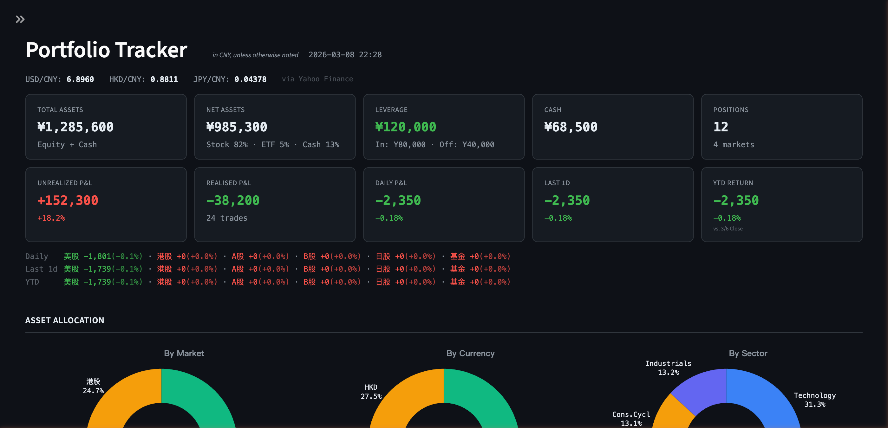

# Portfolio Tracker

中文 | [English](README.md)

基于 Streamlit 的投资组合仪表盘，支持多券商、多币种持仓追踪，实时行情、风险分析与自动备份。



## 功能特性

- **多券商** — 同时管理多个券商账户（富途、中信、招商、盈透等）
- **多币种** — USD、HKD、JPY、CNY 实时汇率换算，统一折合人民币
- **多市场** — A股、B股、港股、美股、日股、基金
- **实时行情** — 股票价格来自 Yahoo Finance，基金净值来自天天基金
- **净值追踪** — 每日快照，累计净值曲线，支持沪深300、标普500、恒指基准对比
- **风险分析** — 剔除出入金影响的波动率、夏普比率、最大回撤、胜率、卡尔玛比率，含滚动趋势图
- **收益归因** — 按市场、按个股的盈亏贡献分解
- **行业分析** — 通过 akshare + yfinance（免费）或 FMP API 获取行业分类
- **自动备份** — 使用 SQLite backup API 安全备份，支持自定义目录，7天日备份 + 月度归档
- **CSV 导入** — 侧边栏批量导入持仓、现金、已平仓交易
- **盈亏日志** — 基于快照的最近30天净盈亏走势
- **资金明细** — 灵活的资金计算模式（成本模式 / 入金模式）

## 快速开始

```bash
git clone https://github.com/alanhewenyu/portfolio-tracker.git
cd portfolio-tracker
pip install -r requirements.txt

# 可选：自定义配置
cp .env.example .env

streamlit run dashboard.py
```

## 数据导入

1. **侧边栏** — 在「Edit」标签页手动添加/编辑/删除持仓
2. **CSV 导入** — 在「Import」标签页下载模板、填写数据、上传导入
3. **Excel 导入** — 命令行工具，适配特定券商对账单格式：
   ```bash
   export PORTFOLIO_EXCEL=~/Desktop/your_portfolio.xlsm
   python import_excel.py
   ```

## 配置说明

复制 `.env.example` 为 `.env`（所有配置均为可选）：

| 变量 | 默认值 | 说明 |
|------|--------|------|
| `FUTU_CAPITAL` | `0` | 券商入金金额（人民币）。保持 0 使用成本模式。 |
| `FUTU_DEPOSIT_FX` | `1.0` | 入金时平均美元兑人民币汇率 |
| `B_SHARE_CAPITAL` | `0` | B股入金金额（人民币）。保持 0 使用成本模式。 |
| `PORTFOLIO_DB_PATH` | `./portfolio.db` | 自定义数据库路径 |
| `BACKUP_DIR` | `./backups` | 备份目录。建议设为云同步文件夹实现异地备份。 |
| `FMP_API_KEY` | _(空)_ | FMP API 密钥，用于行业分类（可选，有免费替代方案） |

### 资金计算模式

根据环境变量自动检测：

- **成本模式**（默认）— 资金 = 持仓成本 + 现金 - 杠杆 - 已实现盈亏。零配置开箱即用。
- **入金模式** — 设置 `FUTU_CAPITAL` 或 `B_SHARE_CAPITAL` > 0，启用基于入金的资金追踪及汇率影响分析。

## 每日快照与备份

设置 cron 定时任务，每日自动采集净值并备份数据库：

```bash
0 6 * * * cd /path/to/portfolio-tracker && python snapshot.py >> snapshot.log 2>&1
```

备份保存至 `BACKUP_DIR`（默认 `./backups/`）。保留策略：最近7天日备份 + 每月1号归档（永久保留）。

**建议：** 将 `BACKUP_DIR` 设置为云同步文件夹（如 iCloud、OneDrive、坚果云），实现自动异地备份。

## 项目结构

```
dashboard.py    — Streamlit 主应用（KPI卡片、图表、表格、侧边栏管理）
db.py           — SQLite 数据库、迁移、资金计算、CRUD 操作
prices.py       — 行情获取（yfinance、天天基金）、汇率、缓存
snapshot.py     — 每日净值快照 + 数据库备份
import_excel.py — Excel 批量导入（券商对账单格式）
fmp.py          — 行业分类（FMP / akshare / yfinance 多级回退）
```

## 技术栈

- **前端**：Streamlit + Plotly
- **数据库**：SQLite (WAL 模式)
- **行情**：yfinance、天天基金 API
- **汇率**：Yahoo Finance + exchangerate.host 备用
- **行业**：akshare + yfinance（免费），可选 FMP API

## 参与贡献

欢迎贡献代码！参与方式：

1. Fork 本仓库
2. 创建功能分支 (`git checkout -b feature/your-feature`)
3. 提交更改 (`git commit -m 'Add some feature'`)
4. 推送到分支 (`git push origin feature/your-feature`)
5. 发起 Pull Request

Bug 反馈和功能建议请 [提交 Issue](https://github.com/alanhewenyu/portfolio-tracker/issues)。

## 许可证

MIT License — 详见 [LICENSE](LICENSE)
